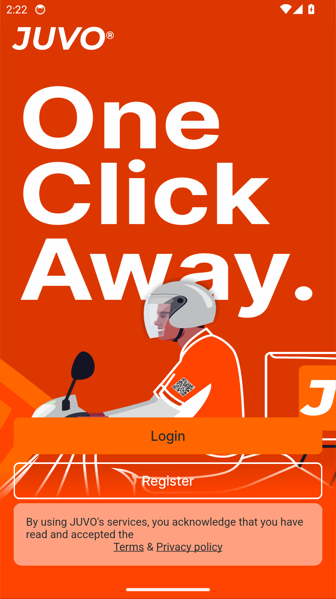
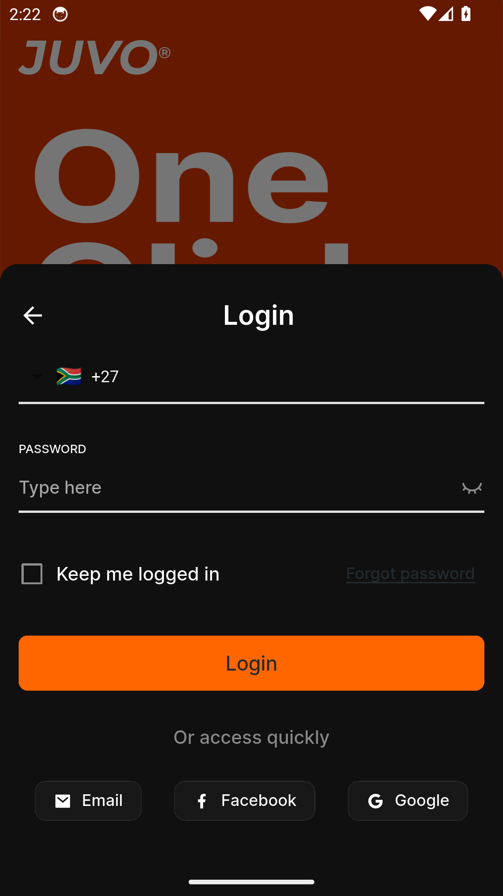
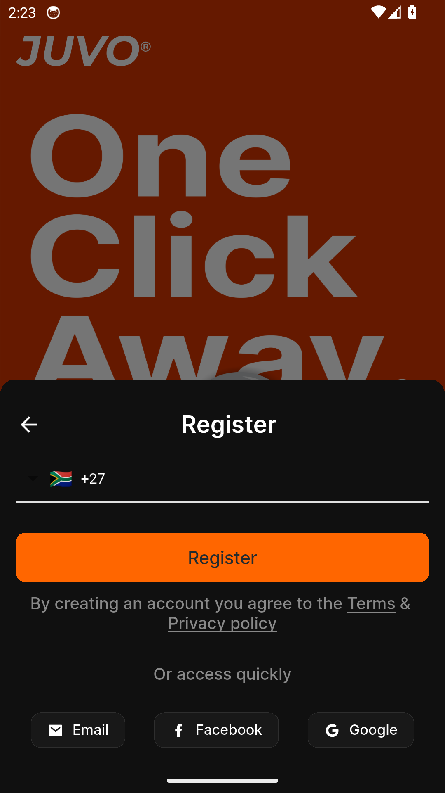
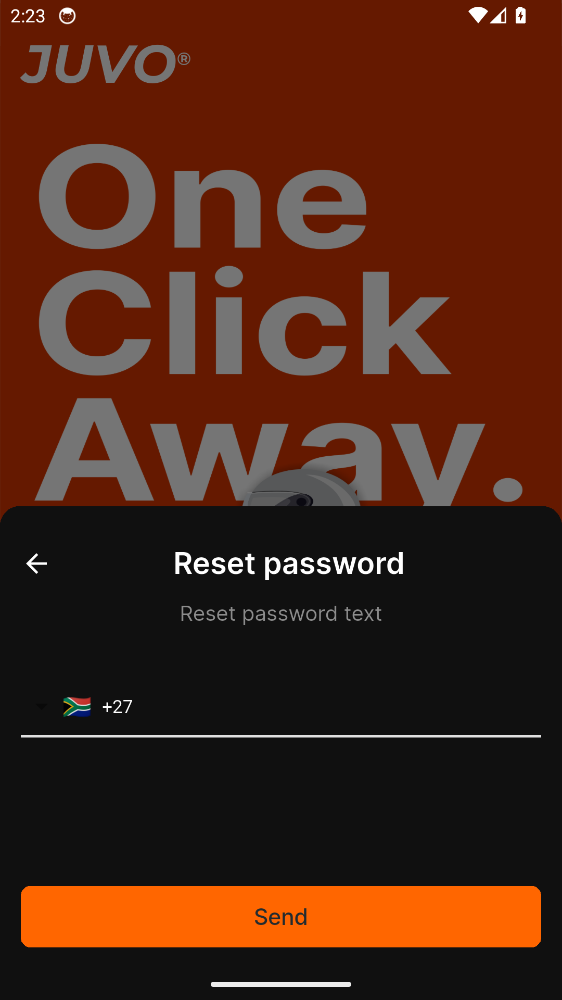

# Manager — Feature Guide

Run your store from your pocket

> This guide is generated automatically on every merge: CI builds the
> app with its built-in demo dataset, walks the guided tour on an
> Android emulator, and captures each screen below. Content shown is
> demo data.

## 1. Welcome to Manager

Manager runs your whole store from one screen - and in this demo build, any
sign-in details work.

## 2. Sign in

Signing in to Manager is quick and simple.

## 3. Create an account

New to Manager? Create your account in a few easy steps.

## 4. Reset your password

Forgot your password? Manager gets you back in with a secure reset.
