# Manager — Feature Guide

Run your store from your pocket

> This guide is generated automatically on every merge: CI builds the
> app, walks the guided tour on an Android emulator, and captures
> each screen below.

## 1. Welcome to Manager

Manager runs your whole store from one screen - sign in to get started.

## 2. Sign in

Signing in to Manager is quick and simple.

## 3. Create an account

New to Manager? Create your account in a few easy steps.

## 4. Reset your password

Forgot your password? Manager gets you back in with a secure reset.

## 5. Sell straight from the camera

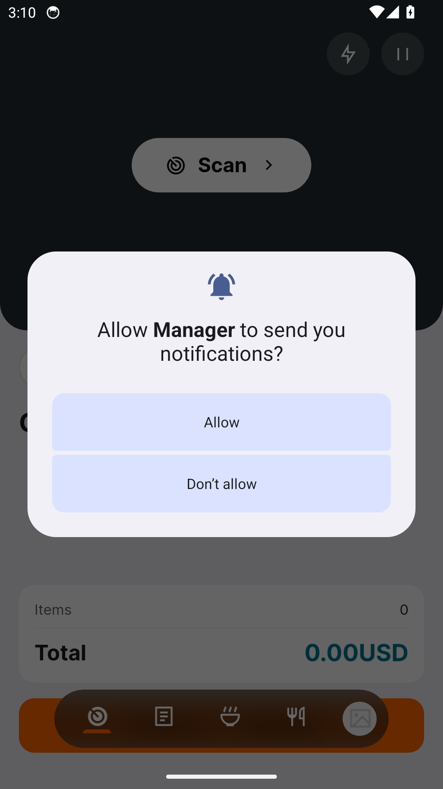

The till is the first thing a store owner sees - point it at any barcode and
every scan lands the product in the cart, with torch and battery-saving auto-
pause built in.

## 6. The cart keeps up

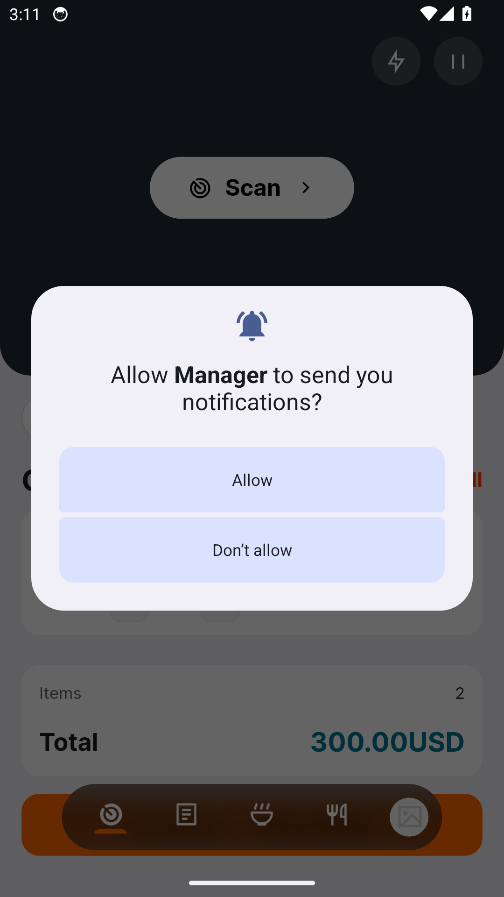

Steppers, decimal weights for loose goods, live formatted totals - and Clear All
for when the customer changes their mind.

## 7. Cash, QR - or offline by code

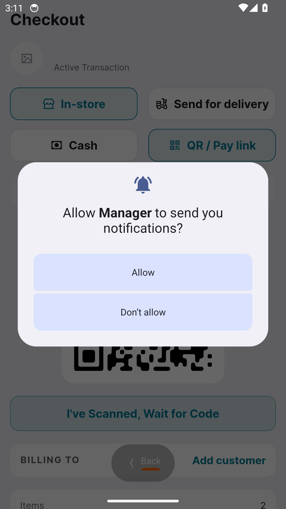

Take cash or a pay-link QR the customer scans on their own phone; if the till
drops offline they still pay the link and a 6-digit code confirms it at the
counter - the sale syncs itself later.

## 8. Everything else, one tap away

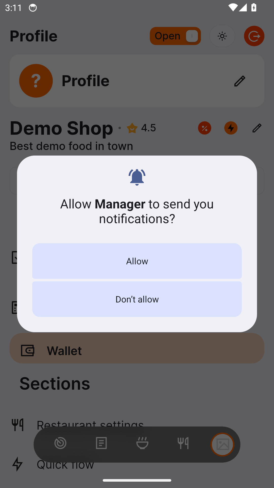

The restaurant hub is the spine of the app - your shop's identity up top, and
every setting, section and report a tap below it.

## 9. Nothing gets lost offline

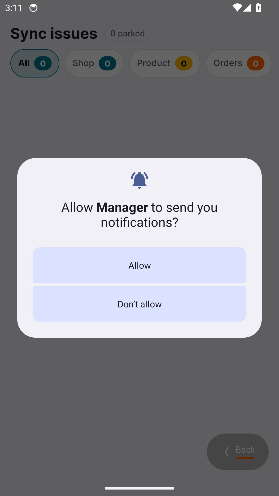

Sell through any outage - offline work syncs back by itself, and anything that
snags waits here with retry or discard.

## 10. Your menu, organised

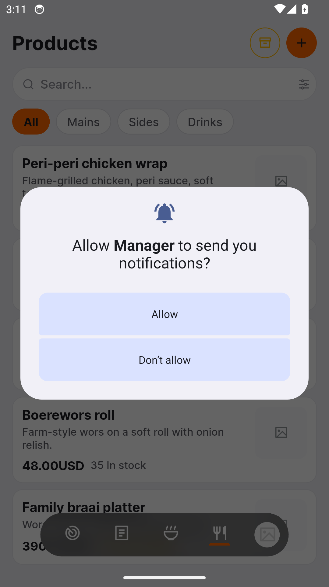

Your whole menu in one place - products, add-ons and extras, each on its own
tab, priced and stocked.

## 11. List a product in minutes

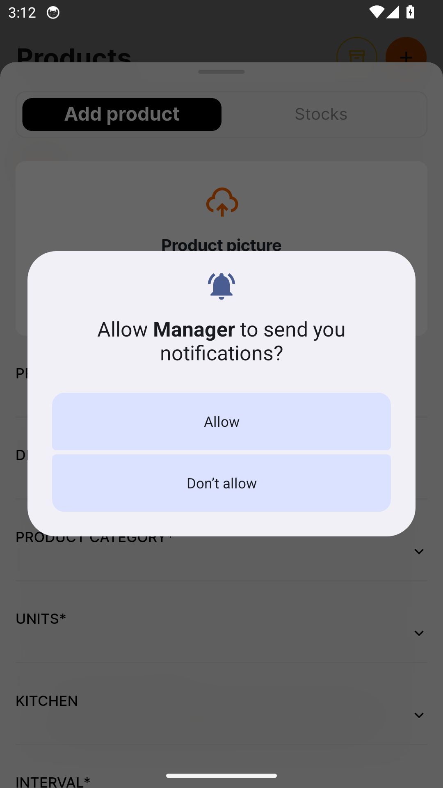

Name it, price it, stock it - a new product is ready to sell in minutes.

## 12. Every order, one queue

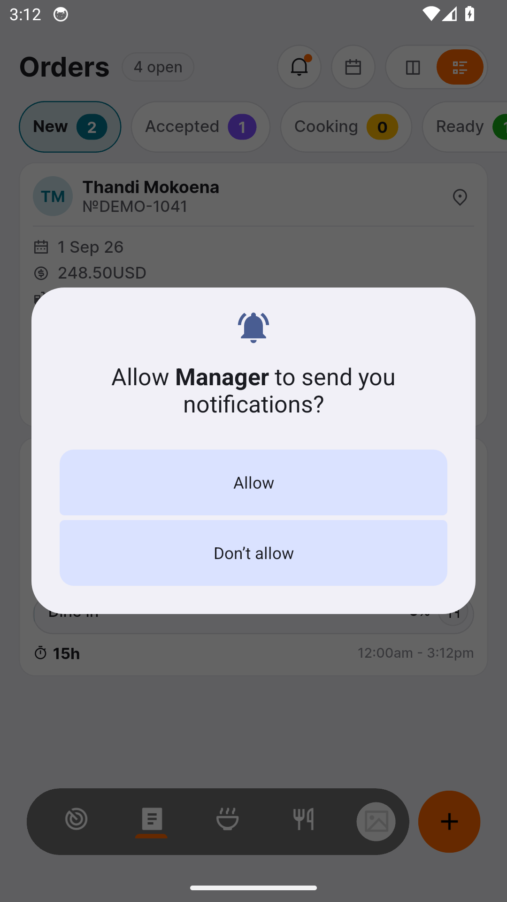

New, accepted, ready, on the way - every order moves through one queue the
moment it lands.

## 13. The paper trail, kept

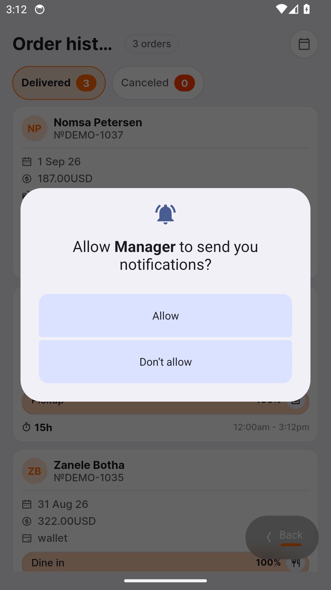

Every completed sale stays on record - scroll back through your full history any
time.

## 14. The kitchen sees every order

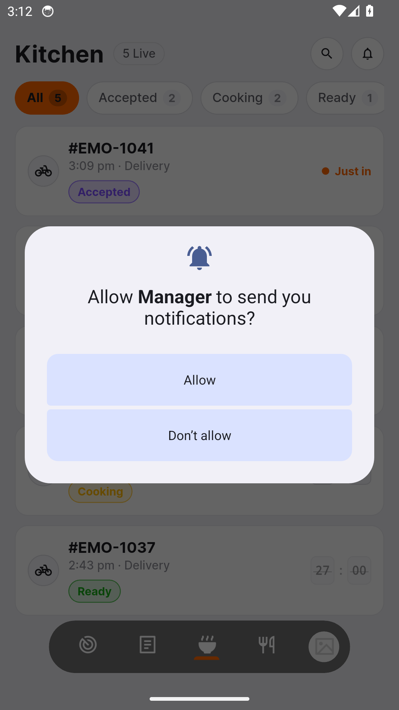

Accepted, cooking, ready - the kitchen queue tracks every dish with a live
clock, so nothing burns and nothing waits.

## 15. Speak your language

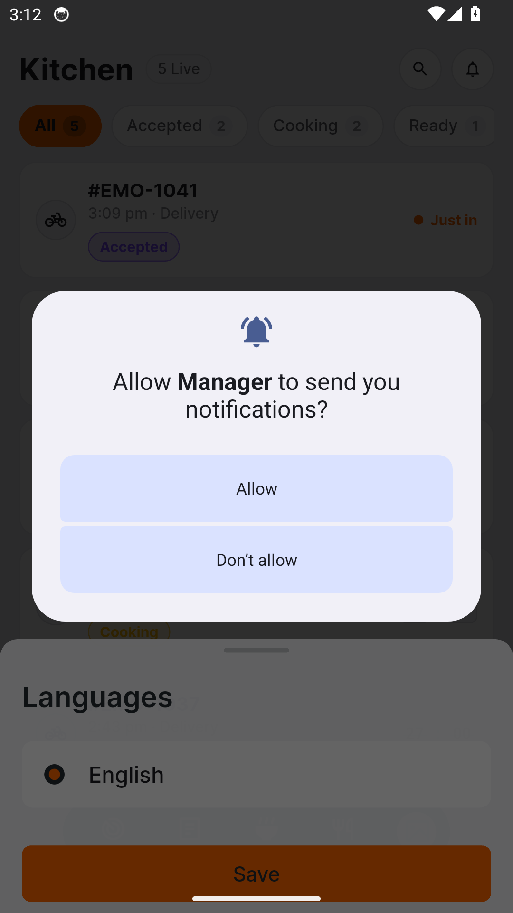

Manager speaks your language - pick it once in the language sheet and every
screen follows.

## 16. Money at a glance

Today, this week or this month - every rand earned, charted day by day.

## 17. Plans without surprises

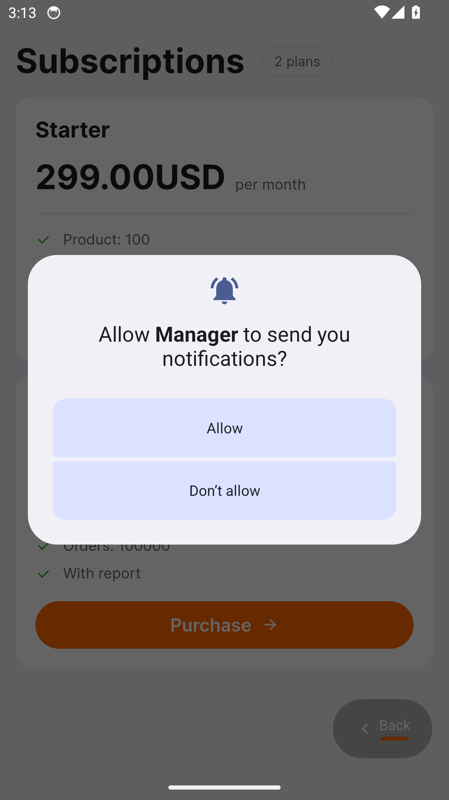

Compare plans side by side and switch in a tap - clear pricing, no surprises.

## 18. Plan your day in seconds

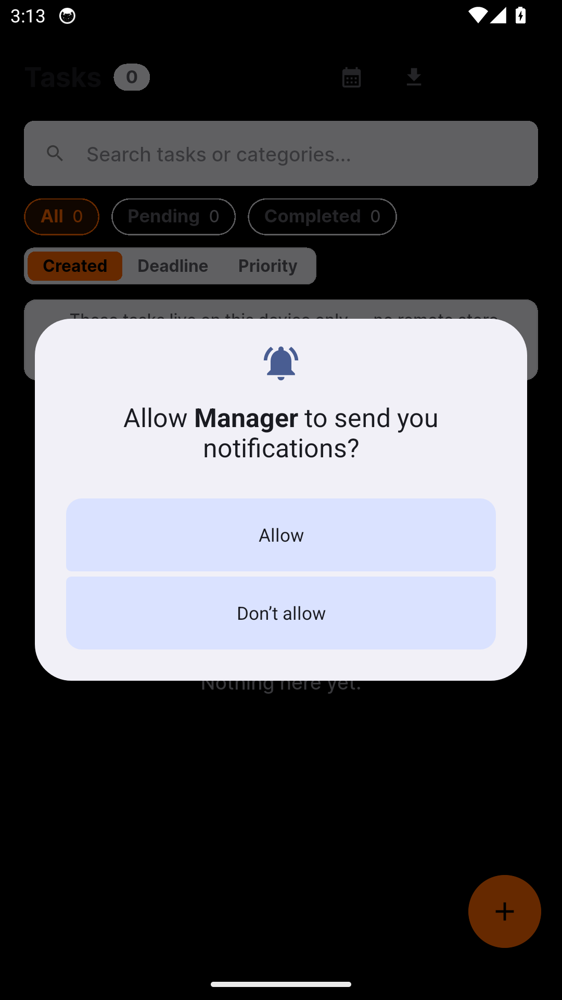

Capture to-dos with subtasks and categories - your day, planned before it
starts.

## 19. A calculator, right where you work

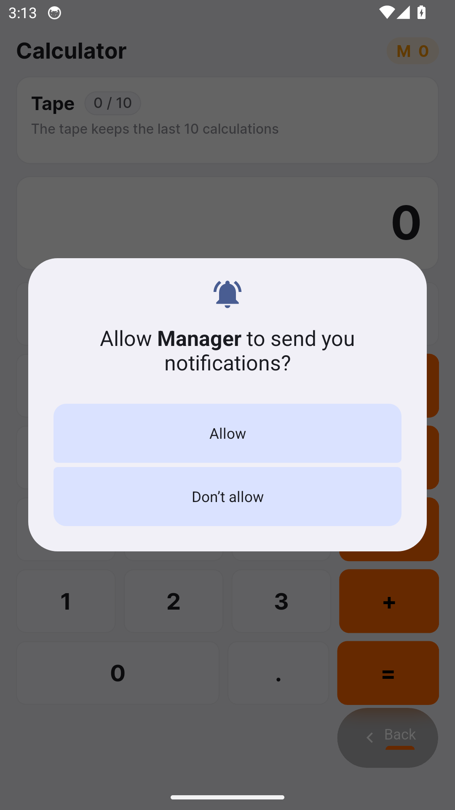

Quick sums without switching apps - a full calculator built in.
